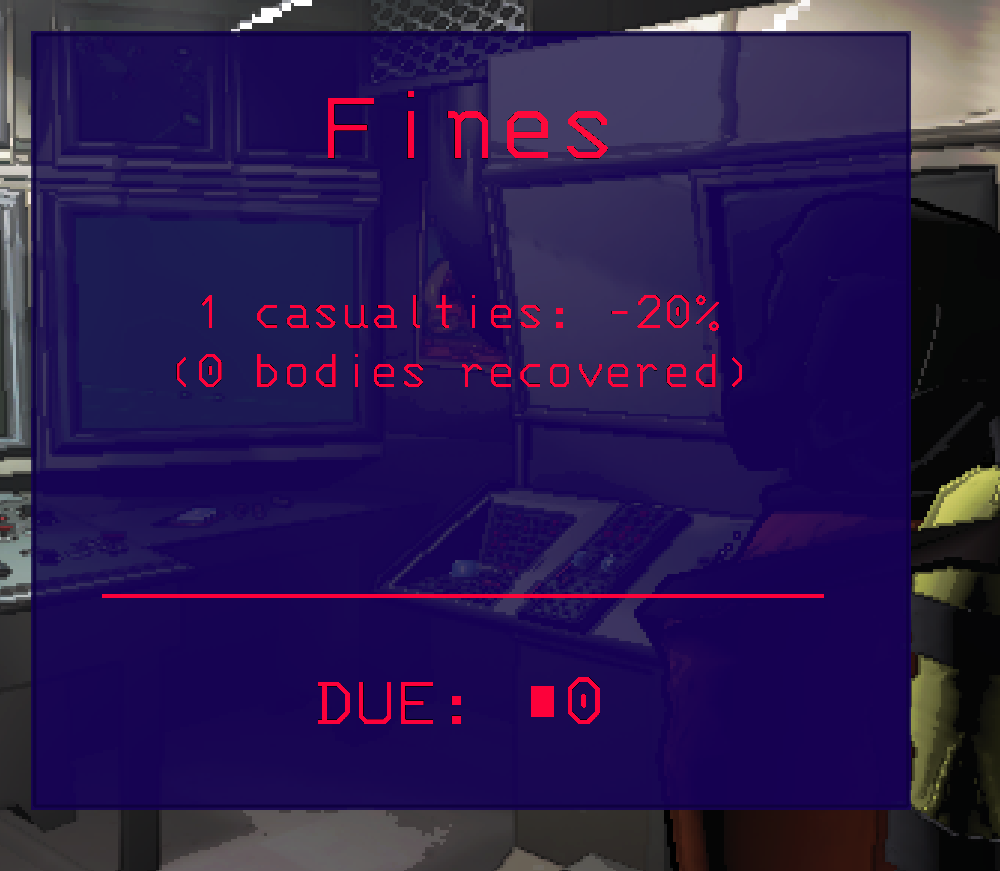
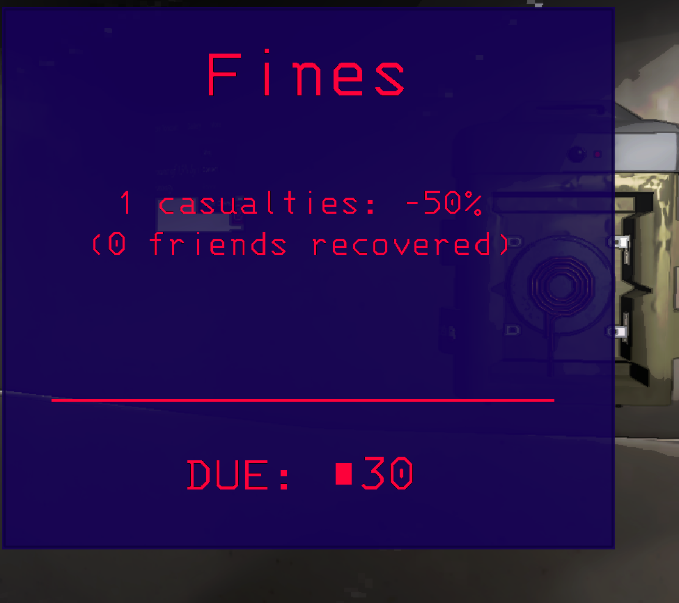

# Scaled Penalties

[https://thunderstore.io/c/lethal-company/p/MigisFring/ScaledPenalties/](https://thunderstore.io/c/lethal-company/p/MigisFring/ScaledPenalties/)

Scales the penalties recieved for not saving your friends.

- Penalty recieved is 1/(total players)
- Penalty recieved when bringing dead player back to ship removed entirely (If you rescue 1 out of 2 bodies, you will only recieve 1 instance of a penalty)

before

after (2 player lobby)

